# Network Traffic Analysis using Wireshark and Zeek

## Project Overview

This project demonstrates how network traffic can be captured and analyzed using Wireshark and Zeek.

The objective is to understand different network protocols, monitor traffic generated by normal activities, and analyze logs produced by Zeek.

---

## Objectives

- Capture live network traffic
- Analyze ICMP packets
- Analyze DNS requests
- Analyze TCP connections
- Analyze HTTPS traffic
- Generate Zeek logs
- Understand network behavior

---

## Tools Used

- Ubuntu 22.04
- Oracle VirtualBox
- Wireshark
- Zeek
- Terminal

---

## Methodology

Started packet capture in Wireshark.
Generated traffic using ping.
Visited websites (e.g., GitHub, Wikipedia).
Captured DNS and HTTPS traffic.
Ran Zeek to generate logs.
Analyzed packets and logs.

---

## step 1: start wireshark

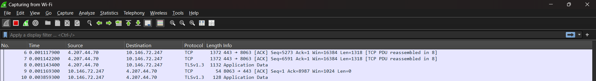

---

## step 2: ping google

```bash
ping google.com
```

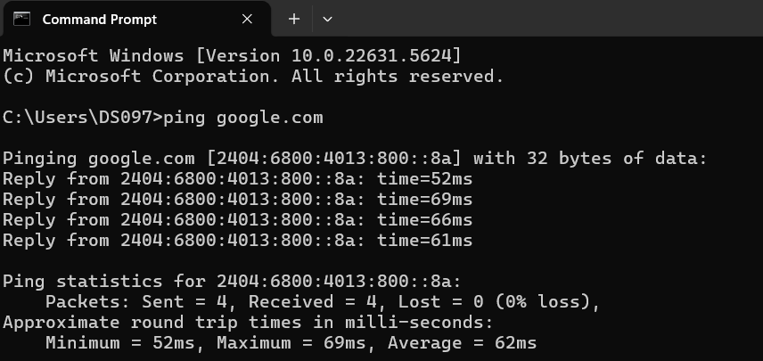

## step 3: run diffrent services


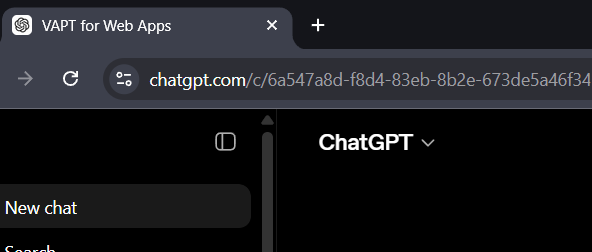


## step 4: stop wireshark and save the log file

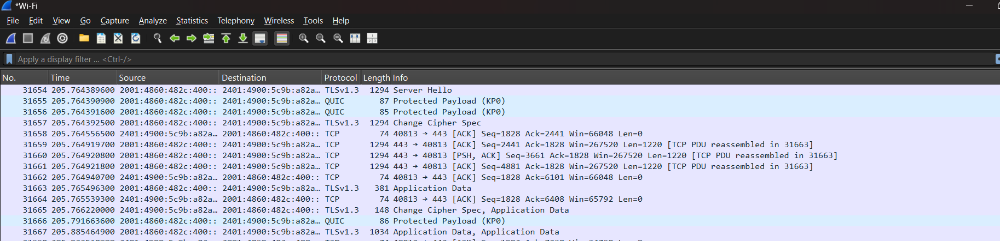

## step 5: analyze the logs and aply filters

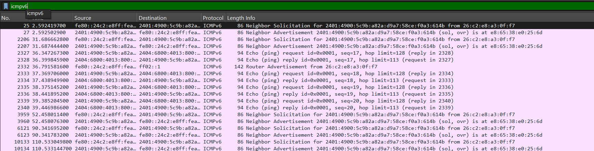

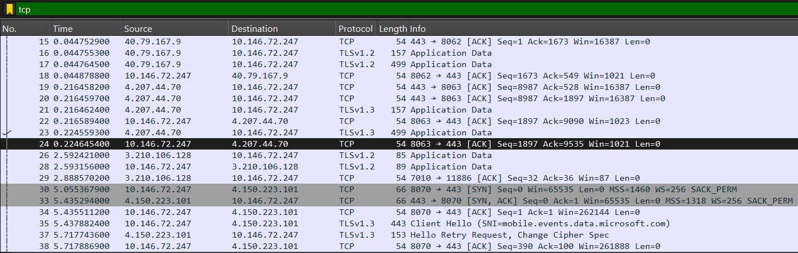

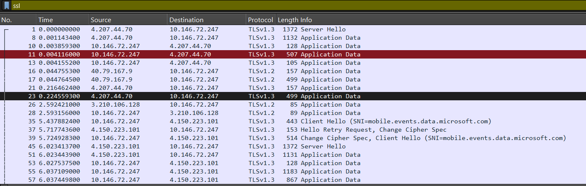

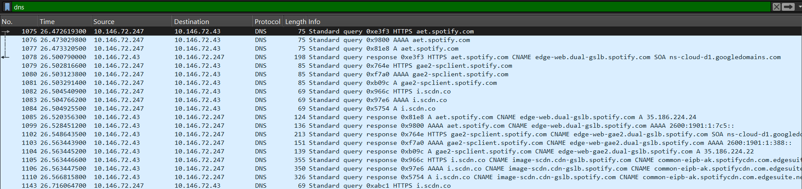

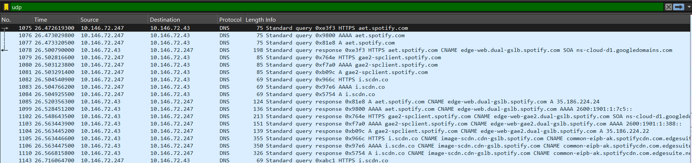

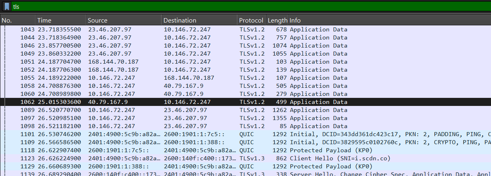

## Wireshark Packet Capture

The packet capture generated during this project has been uploaded to the repository.

### Capture File

📄 **Capture File:** [`capture4.pcapng`](pcap/capture4.pcapng)

The capture includes:
- ICMP (Ping) packets
- DNS queries and responses
- TCP connections
- UDP traffic
- TLS/HTTPS communication

## zeek 
then using zeek in ubuntu server22.04 and following the steps as stated below 

## step 1: start zeek 
using the command
```bash
/opt/zeek/bin/zeekctl deploy
```
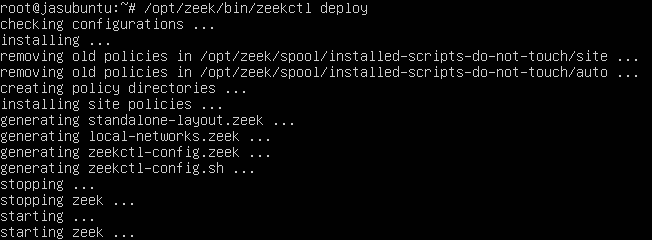

## step 2: check status 
whether the zeek is running or not
```bash
/opt/zeek/bin/zeekctl status
```


## step 3: generating network traffic

 we are going to use curl to generate some network trafic in command line as we don't have browser in ubuntu server

```bash
curl -L https://google.com
curl -L https://wikipedia.com
curl -I https://1.1.1.1
curl -I https://0.0.0.0
```
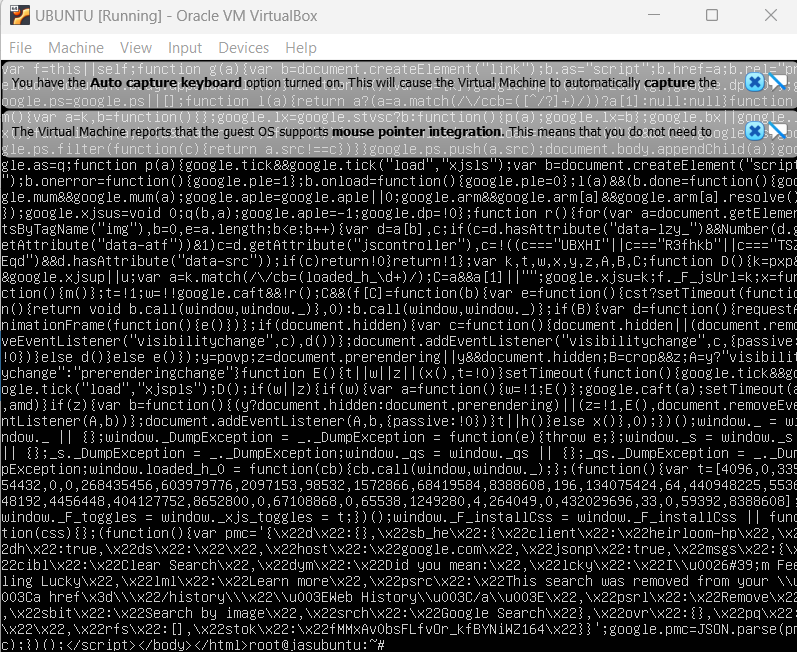

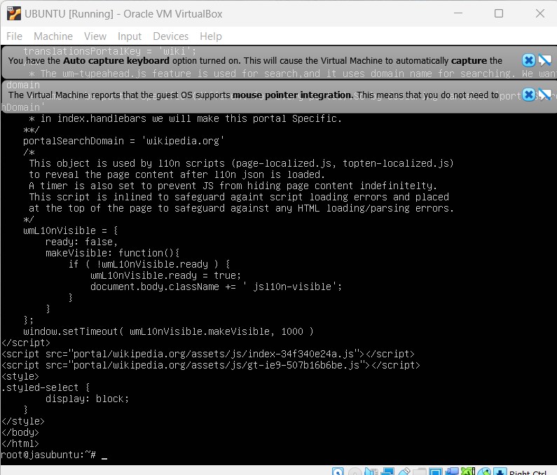

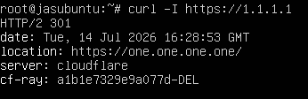

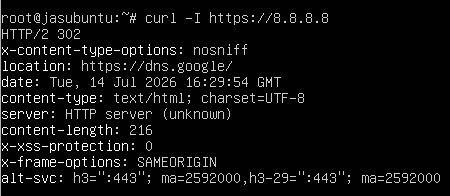

also created DNS logs using 
``` bash
nslookup google.com
```
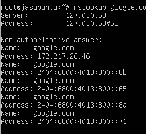

and we also used ping command to create traffic to generate ICMP packets and generated multiple pings.

```bash
ping 0.0.0.0 -c20
```
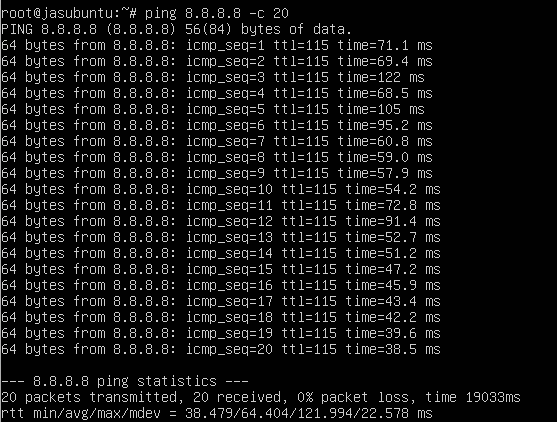

## step 4: log files
we are going to check the current logs that are generated with the traffic.
```bash
ls -l /opt/zeek/spool/zeek
```
This command lists all log files generated by Zeek after analyzing the captured network traffic.
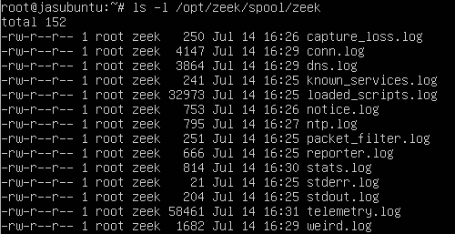

---

## Step 8.2 View Connection Log (conn.log)

### Description

The `conn.log` file records every network connection observed by Zeek, including source IP, destination IP, ports, protocol, connection duration, bytes transferred, and connection state.

### Bash Command

```bash
less /opt/zeek/spool/zeek/conn.log
```

### Screenshot

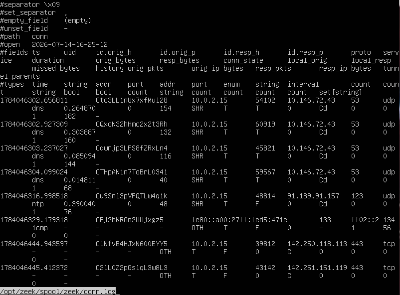

---

## Step 8.3 View Notice Log (notice.log)

### Description

The `notice.log` file stores security notices and important events detected during network monitoring.

### Bash Command

```bash
less /opt/zeek/spool/zeek/notice.log
```

### Screenshot

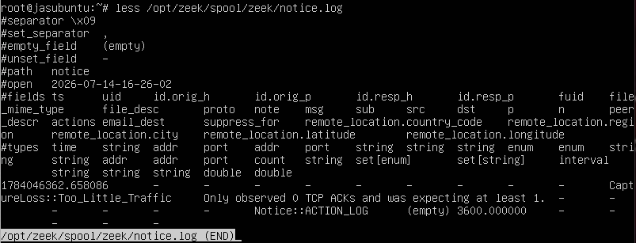

---

## Step 8.4 View Capture Loss Log

### Description

The `capture_loss.log` file reports whether any packets were lost during packet capture.

### Bash Command

```bash
less /opt/zeek/spool/zeek/capture_loss.log
```

### Screenshot

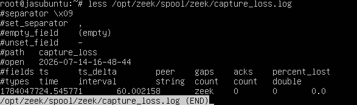

---

## Step 8.5 View DNS Log (dns.log)

### Description

The `dns.log` file contains all DNS queries and responses captured during network traffic analysis.

### Bash Command

```bash
less /opt/zeek/spool/zeek/dns.log
```

### Screenshot

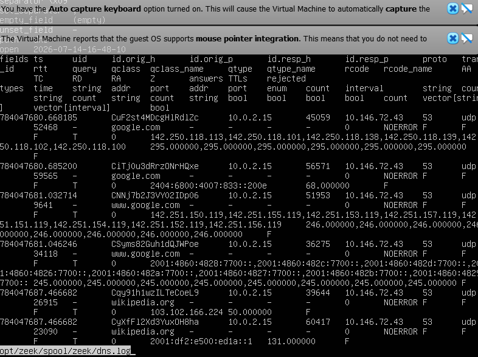

---

## Step 8.6 View Known Services Log

### Description

The `known_services.log` file lists services detected by Zeek along with their associated ports and protocols.

### Bash Command

```bash
less /opt/zeek/spool/zeek/known_services.log
```

### Screenshot

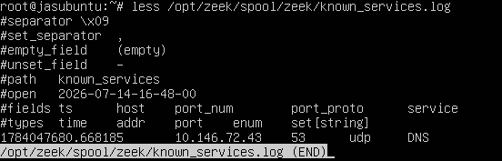

---

## Step 8.7 View Loaded Scripts Log

### Description

The `loaded_scripts.log` file shows all Zeek scripts loaded during startup.

### Bash Command

```bash
less /opt/zeek/spool/zeek/loaded_scripts.log
```

### Screenshot

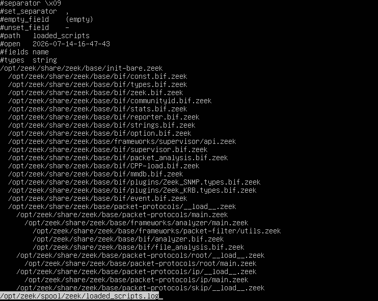

---

## Step 8.8 View NTP Log

### Description

The `ntp.log` file records Network Time Protocol (NTP) traffic observed during packet capture.

### Bash Command

```bash
less /opt/zeek/spool/zeek/ntp.log
```

### Screenshot

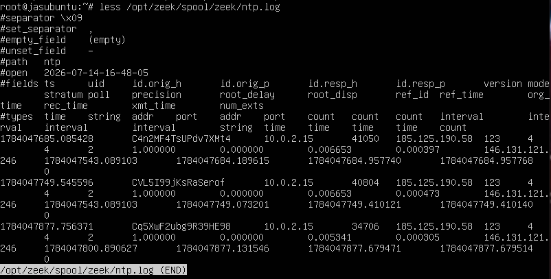

---

## Step 8.9 View Packet Filter Log

### Description

The `packet_filter.log` file displays the packet filtering configuration used by Zeek.

### Bash Command

```bash
less /opt/zeek/spool/zeek/packet_filter.log
```

### Screenshot

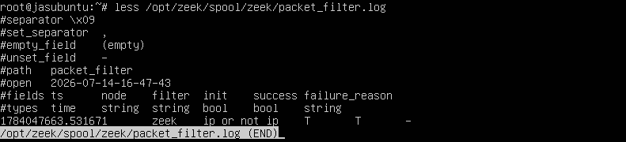

---

## Step 8.10 View Reporter Log

### Description

The `reporter.log` file contains warning, error, and informational messages generated while Zeek was running.

### Bash Command

```bash
less /opt/zeek/spool/zeek/reporter.log
```

### Screenshot


---

## Step 8.11 View Statistics Log

### Description

The `stats.log` file provides runtime statistics, packet processing information, and performance metrics.

### Bash Command

```bash
less /opt/zeek/spool/zeek/stats.log
```

### Screenshot

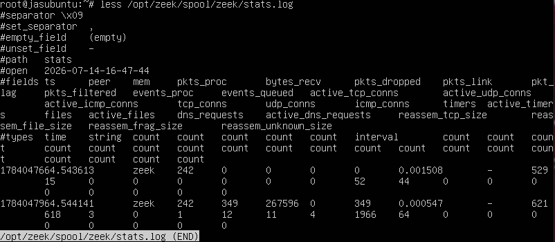

---

## Step 8.12 View Standard Error Log

### Description

The `stderr.log` file stores error messages produced by Zeek during execution.

### Bash Command

```bash
less /opt/zeek/spool/zeek/stderr.log
```

### Screenshot


---

## Step 8.13 View Standard Output Log

### Description

The `stdout.log` file contains general output messages generated while Zeek was running.

### Bash Command

```bash
less /opt/zeek/spool/zeek/stdout.log
```

### Screenshot


---


## Step 8.14 View Telemetry Log

### Description

The `telemetry.log` file contains Zeek runtime telemetry and internal performance information.

### Bash Command

```bash
less /opt/zeek/spool/zeek/telemetry.log
```

### Screenshot

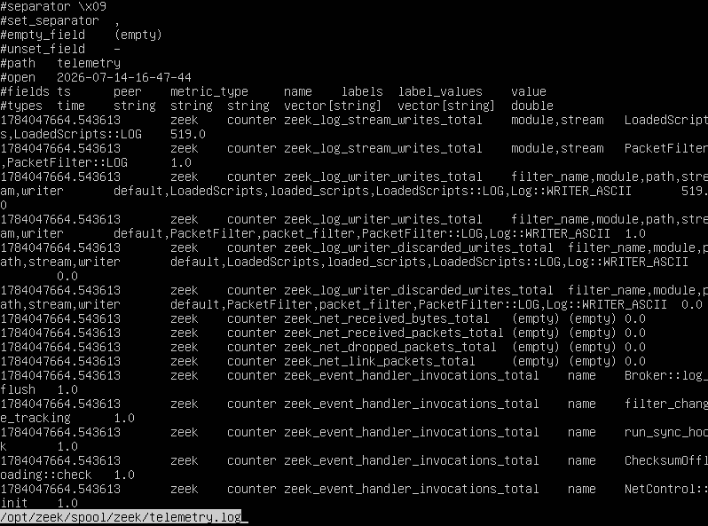

---

## Step 8.15 View Weird Log

### Description

The `weird.log` file records unusual or unexpected network events detected during packet analysis.

### Bash Command

```bash
less /opt/zeek/spool/zeek/weird.log
```

### Screenshot

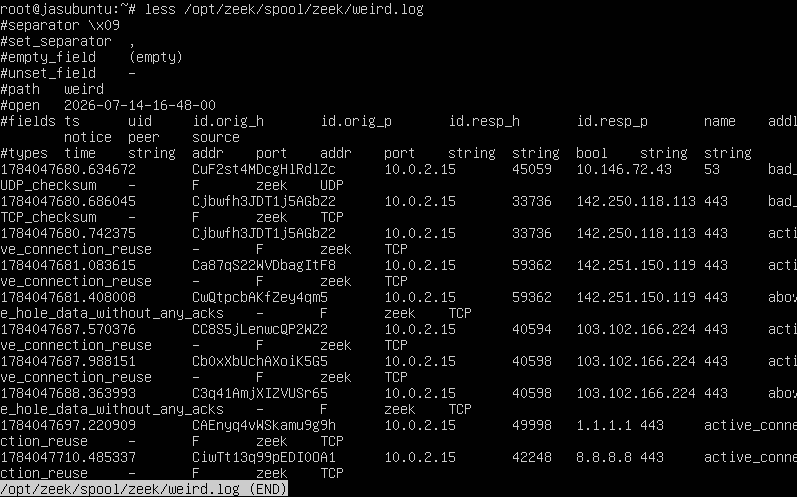

## Step 8.16 Stop Zeek

### Description

After completing the traffic analysis, the Zeek service was stopped.

### Bash Command

```bash
sudo /opt/zeek/bin/zeekctl stop
```

### Screenshot


## Commands Used

All commands used during this project are available in:

📄 [`commands/commands_used.txt`](commands/commands_used.txt)
